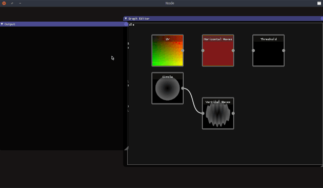

# Node
Node is experiment for a node-oriented image editor. Most image editors use a workflow based in layers, this works well but does not presents very little flexibility and requires a lot of manual work to keep it from resulting into a chaotic mess aggregation of layers. 

